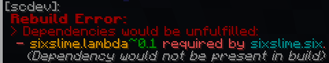

# Using Scdev

This section exclusively covers interacting with SlimeCore through the [SCDev](https://github.com/sixslimemc/scdev) frontend.

## Getting Setup

SCDev interfaces entirely through chat messages, sending them to **listeners**. \
To make yourself a listener, add the tag `scdev.listener` to yourself.
```mcfunction
tag @s add scdev.listener
```

Verify that you are a listener by running `/reload`--you should recieve a [load summary](#load-summaries).

### Clickable Text

Many SCDev messages contain clickable/hoverable text. If you want more information about something mentioned in a message, try hovering and/or clicking on it.

## Load Summaries

Upon every world reload, a **load summary** is sent to listeners.

Load summaries include:
- **Preload Entrypoints:** All enabled preload entrypoints in their calling order
- **Packs:** All SlimeCore-loaded packs in their loading order
- **Entrypoints:** All enabled entrypoints in their calling order

For most administrative purposes, only the "Packs" section is relevant.

If a [rebuild](./key_concepts.md#rebuilding) fails, the subsequent load summary will be supressed in order to bring attention to the [rebuild error message(s)](#rebuild-messages).

*Example of load summary:*


*Example of supressed load summary:*


## Rebuild Messages

Upon [rebuilding](./key_concepts.md#rebuilding), a "Rebuilding..." message will be sent, followed by a "Rebuild success." message if rebuilding was successful. If rebuilding failed, a descriptive error message will be sent instead. \
*Refer to [this section](./troubleshooting.md#rebuild-errors) for resolving rebuild errors.*

If "Rebuilding..." is sent but no messages are sent afterward, this may indicate an [unfinished rebuild](./troubleshooting.md#unfinished-loadingrebuilding). However, it is normal for the rebuild process to take [some time](./troubleshooting.md#very-long-rebuilding).

*Due to the nature of rebuilding, rebuild messages will always be immediately followed by a [load summary](#load-summaries).*

*Example of rebuild success:*


*Example of rebuild error:*



## Explicit Rebuilding

The function `scdev:-/rebuild` directly initiates an [explicit rebuild](./key_concepts.md#managing-datapacks-explicit-rebuilding).

**Explicit rebuilding is the only proper way to enable/disable/uninstall SlimeCore-loaded datapacks. Using `/datapack` for such operations is improper and may cause unexpected behavior.**

`scdev:-/rebuild` takes `args` as a macro argument for input, which is a struct with the following optional keys:
| Key | Type | Description | Default | Example Value |
| :-- | :-- | :-- | :-- | :-- |
| `disable` | list of pack IDs | Packs to disable that are currently enabled. | `[]` | `[scdev, foo]` |
| `enable` | list of pack IDs | Packs to enable that are currently disabled. | `[]` | `[scdev, bar]` |
| `uninstall` | list of pack IDs | Packs to uninstall that are currently installed. | `[]` | `[scdev, bar]` |
| `clean` | boolean | Whether to force a [clean rebuild](./troubleshooting.md#clean-rebuilding). | `false` | `true` |


*Example usage:*
```mcfunction
# would attempt to disable the packs with pack IDs 'foo' and 'bar':
function scdev:-/rebuild {args:{disable:[foo, bar]}}
# would simply rebuild with no staged changes:
function scdev:-/rebuild {args:{}}
```

*SCDev itself can be safely disabled/uninstalled this way, however, if successful, no rebuild success message or load summary will be sent.*

## Info Functions

### List Functions

###